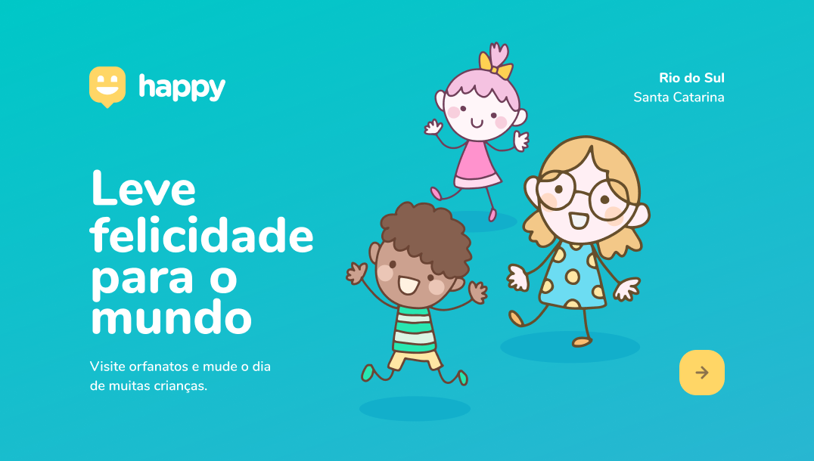

# Next Level Week 3 :rocket:

## Objetivo :dart: 
A Next Level Week é um evento gratuito com a duração de uma semana, que tem como objetivo levar os participantes a um novo nível na carreira de desenvolvimento web. A terceira edição ocorreu dos dias 12 a 16 de outubro de 2020. 

## Desenvolvimento :computer:
Utilizando as tecnologias Java Script, HTML, CSS e node js, foi criado, do zero, um site chamado _Happy_, que foi idealizado para conectar pessoas com orfanatos, sendo possível pesquisar os presentes em sua cidade para realizar visitas no mesmo. 

###### <a href="https://www.figma.com/file/GOcnQ9SEQDDvbGHfiRgReW/Happy-Web-(Copy)?node-id=48625%3A901"> Clique aqui para ver design completo | Feito por Tiago Luchtenberg</a>
